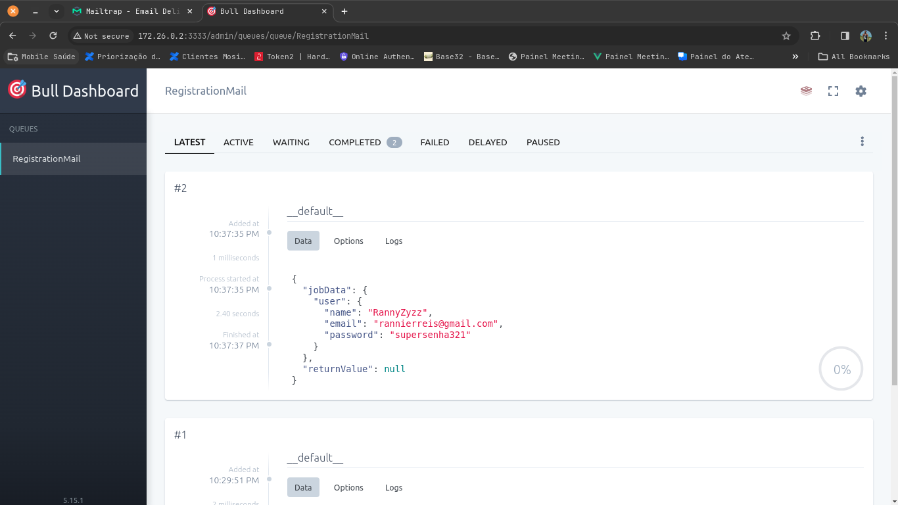

## Implementação em Node TypeScript do Framework Express com Redis e Bull para envio de filas

### Descrição

Este projeto demonstra uma implementação didática em Node TypeScript do framework Express com Redis para envio de filas utilizando a biblioteca Bull. A biblioteca Bull fornece uma interface robusta para gerenciar filas de tarefas assíncronas, tornando o processamento de tarefas em segundo plano eficiente e escalável.

#### Importante: 
Esta implementação visa fins didáticos e não leva em consideração a escalabilidade e horizontalidade de grandes projetos. Em tais casos, é recomendável que o Redis e a aplicação sejam executados em containers separados para evitar dependências e garantir a alta disponibilidade dos serviços.


### Funcionalidades

* Criação e gerenciamento de filas
* Adição de jobs às filas
* Processamento de jobs em segundo plano
* Monitoramento de jobs e filas
* Retentativas automáticas em caso de falhas
* Priorização de jobs
* Limitação de taxa de processamento
* Suporte a vários tipos de jobs

### Tecnologias

* Node TypeScript
* Framework Express
* Redis
* Biblioteca Bull

### Instalação

```
git clone https://github.com/RannyZyzz/node-background-jobs.git
```
É necessário incluir o arquivo `.env` na raiz do projeto, passando as configurações do servidor SMTP (para testes basta criar uma conta no mailtrap).
```env
MAIL_HOST=
MAIL_PORT=
MAIL_USER=
MAIL_PASS=

REDIS_HOST=redis
REDIS_PORT=6379
```

### Uso

* É necessário ter o Docker instalado no equipamento
* Acesse a pasta do projeto clonado no github `node-background-jobs`
* Inicie a aplicação: `docker compose up -d`
* Com a aplicação iniciada realize requisições **POST** para o método `IP:3333/users`
* O corpo da requisição do tipo **JSON**:
```json
{
 	"name":"RannyZyzz",
  	"email": "rannierreis@gmail.com",
  	"password":"supersenha321"
}
```

### Monitoramento
Para visualizar a fila acesse o método `IP:3333/admin/queues`


* Utilizado o painel de controle da biblioteca Bull para monitorar jobs e filas: [https://github.com/felixmosh/bull-board](https://github.com/felixmosh/bull-board)


### Recursos adicionais

* Documentação da biblioteca Bull: [https://github.com/OptimalBits/bull](https://github.com/OptimalBits/bull)

### Observações

* Este projeto é um exemplo básico e pode ser adaptado para atender às suas necessidades específicas.
* É importante configurar o Redis de acordo com o volume de jobs que serão processados.
* A biblioteca Bull oferece diversas opções de configuração para otimizar o processamento de jobs (veja a documentação da bibilioteca)

### Contribuições

* Sinta-se à vontade para contribuir com este projeto enviando pull requests.
* Se você encontrar algum problema, por favor, abra um issue no GitHub.

### Licença

Este projeto está licenciado sob a licença MIT.
